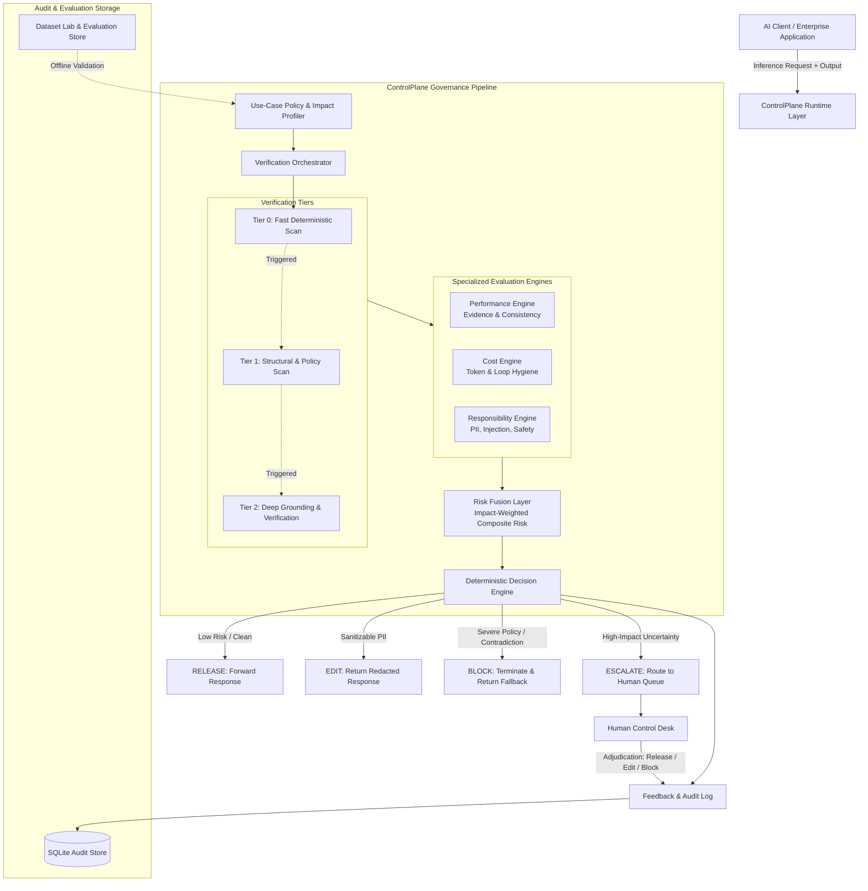

# ControlPlane.ai

ControlPlane.ai is a risk-adaptive runtime AI governance layer that intercepts LLM responses in real time and deterministically decides whether to RELEASE, EDIT, BLOCK, or ESCALATE them before they reach users or downstream systems.

---

## The Problem

Enterprises deploying Generative AI into customer-facing, operational, or analytical workflows face four operational challenges:

1. **Confidently Incorrect Outputs**: Large language models produce factual contradictions and hallucinated commitments with high confidence. When an AI confirms a non-existent refund, misquotes a legal term, or promises unauthorized discounts, organizations face immediate financial and reputational liabilities.
2. **Excessive Verification Overhead**: Evaluating every single model generation through heavy secondary models or comprehensive retrieval pipelines introduces severe latency penalties (1–3+ seconds) and inflates token costs by 200–400%, making production AI systems economically unsustainable.
3. **Responsibility & Compliance Violations**: Unchecked model responses can leak sensitive Personally Identifiable Information (PII), fall prey to prompt injection and jailbreak payloads, or exhibit demographic and fairness biases that violate internal governance policies.
4. **Uniform Treatment of Asymmetric Risk**: Static guardrails treat low-stakes queries (e.g., store hours) with the exact same scrutiny as high-stakes transactions (e.g., payment authorizations and HR recommendations), resulting in either dangerous under-protection or crippling operational friction.

---

## The Core Idea: Risk-Adaptive Verification

Checking every AI response with the same heavy verification pipeline is inefficient. ControlPlane replaces uniform guardrails with **Risk-Adaptive Verification**: dynamic, tiered inspection proportional to the business impact and operational risk of each individual request.

```
+-----------------------------------------------------------------------------+
|                        RISK-ADAPTIVE VERIFICATION                           |
|                                                                             |
|  Low-Risk Queries           Moderate-Risk Claims         High-Impact Stakes |
|  e.g., General Info         e.g., Support PII / Edit     e.g., Disputes/HR  |
|                                                                             |
|       [ Tier 0 ]                  [ Tier 1 ]                  [ Tier 2 ]    |
|   Fast Deterministic Scan      Structural & Policy Scan    Deep Source Check|
|       (5-20 ms)                  (20-100 ms)                 (50-200 ms)    |
|           |                           |                           |         |
|           v                           v                           v         |
|      [ RELEASE ]                   [ EDIT ]             [ BLOCK / ESCALATE ]|
+-----------------------------------------------------------------------------+
```

- **Low Risk**: Subject to fast, deterministic scans (PII regex, injection heuristics, token bounds). If clean, responses are immediately **RELEASED** with minimal latency (<20 ms).
- **Moderate / Escalating Risk**: Triggers structural policy checks and sanitization. Detectable PII is automatically redacted via safe remediation, allowing an **EDIT** response.
- **High-Impact Claims or Uncertainty**: Subjected to deep Tier 2 evidence verification against authoritative source-of-truth records. Severe contradictions are **BLOCKED**, while ambiguous high-impact cases are routed to human supervisors via **ESCALATE**.

---

## How ControlPlane Works

Every response passes through a deterministic eight-stage governance pipeline:

```
[ AI Response ]
      │
      ▼
1. Use Case & Impact Profiling  ──> Establishes latency budget, policy rules, and business impact (Low, Med, High, Critical)
      │
      ▼
2. Verification Policy Selection ──> Selects profile-specific thresholds (Customer Support, Knowledge, Decision Support)
      │
      ▼
3. Tiered Verification Scan     ──> Executes Tier 0 (Fast scan), Tier 1 (Policy checks), and Tier 2 (Deep ground-truth check)
      │
      ▼
4. Multi-Engine Evaluation      ──> Runs Performance, Cost, and Responsibility engines to generate specialized risk signals
      │
      ▼
5. Risk Fusion                  ──> Scales engine scores by effective Business Impact to compute Composite Risk (0-100)
      │
      ▼
6. Deterministic Decision Engine ──> Applies strict priority: BLOCK > ESCALATE > EDIT > RELEASE
      │
      ▼
7. Human Control Desk           ──> Receives only ESCALATE cases for supervisor inspection and authoritative adjudication
      │
      ▼
8. Audit Logging & Feedback     ──> Persists complete request telemetry, detections, and human reviewer feedback
```

1. **AI Response Ingestion**: The runtime receives the prompt, raw model output, use-case metadata, and available business records.
2. **Use Case & Impact Profiling**: Establishes the operational impact tier (`low`, `medium`, `high`, `critical`) and assigns appropriate latency and verification budgets.
3. **Verification Policy Selection**: Loads profile-specific verification constraints (e.g., strict PII rules for customer support vs. deep grounding for decision support).
4. **Tiered Verification Scan**: Executes Tier 0, Tier 1, and Tier 2 detectors conditionally based on risk triggers.
5. **Multi-Engine Evaluation**: Runs three specialized engines (Performance, Cost, Responsibility) in parallel to evaluate factual consistency, token hygiene, and safety compliance.
6. **Risk Fusion**: Aggregates component signals, scales them by business impact, and computes a unified Composite Risk score (0–100).
7. **Deterministic Decision**: Evaluates safety floors and priority rules to select one of four deterministic actions: `RELEASE`, `EDIT`, `BLOCK`, or `ESCALATE`.
8. **Human Control Desk & Audit**: Escalated cases enter the supervisor queue for human review. Complete telemetry and reviewer feedback are recorded in an append-only audit log.

---

## Architecture

ControlPlane is structured as an inline proxy between upstream AI generation models and downstream business consumers:



---

## The Three Engines

ControlPlane decomposes output evaluation into three specialized engines:

### 1. Performance Engine (Factual Accuracy & Grounding)
- **Evidence Verification**: Deterministically validates extracted business claims (e.g., order statuses, monetary sums, policy terms) against authoritative records.
- **Contradiction Detection**: Identifies direct conflicts between model claims (e.g., *"Refund processed"*) and trusted system state (e.g., `status: REJECTED`).
- **Semantic Verification (Selective)**: Uses small, bounded evaluator calls when rule-based pattern matching encounters lexical ambiguity in high-stakes contexts.
- **Uncertainty Flagging**: If grounding evidence is missing or inaccessible for high-impact claims, emits an uncertainty signal rather than assuming correctness.

### 2. Cost Engine (Token & Execution Hygiene)
- **Token Usage Estimation**: Computes prompt, completion, and total token counts and calculates costs using standard reference pricing models.
- **Loop & Thrashing Detection**: Detects cyclical tool invocations, repeated identical tokens, and agentic reasoning loops before runaway API costs accrue.
- **Retry & Stagnation Detection**: Identifies decaying progress loops and redundant retries in multi-step agent workflows.
- **Context Bloat Analysis**: Flags excessive context window utilization and recommends compaction opportunities.

### 3. Responsibility Engine (Privacy, Safety & Compliance)
- **Deterministic PII Detection**: Uses specialized regular expressions and the Luhn checksum algorithm to identify phone numbers, email addresses, credit cards, PAN cards, and Aadhaar numbers.
- **Prompt Injection Defense**: Evaluates incoming context and responses for instruction override attempts, delimiter smuggling, and roleplay bypass markers.
- **Safety Policy Enforcement**: Screens responses for unauthorized financial guarantees, binding commitments, and regulatory non-compliance.
- **Fairness & Demographic Signals**: Flags overt demographic steering, discriminatory screening heuristics, and bias markers in hiring or evaluation use cases.

*(Note: Pattern matching and detectors in this prototype are heuristic and deterministic rules; they provide bounded baseline protection rather than absolute guarantees.)*

---

## Decision Engine

The Decision Engine takes the impact-weighted composite risk score and engine signals, applying a deterministic priority matrix:

$$\text{BLOCK} \succ \text{ESCALATE} \succ \text{EDIT} \succ \text{RELEASE}$$

| Decision | When Applied | Concrete Action Taken |
| :--- | :--- | :--- |
| **RELEASE** | Composite Risk $<30$, zero high-severity signals, and verification state `VERIFIED` or `NOT_APPLICABLE`. | Response is delivered directly to the client with zero modification. |
| **EDIT** | PII or repairable formatting detected ($25 \le \text{Risk} < 65$) where safe automated redaction is available. | Sensitive entities are sanitized (e.g., `[PHONE REDACTED]`, `[EMAIL REDACTED]`) and the safe response is returned. |
| **BLOCK** | Critical factual contradiction, prompt injection attack, or severe financial risk ($\text{Risk} \ge 75$ or Critical severity). | Output is terminated immediately; a safe fallback error message is returned; prevented liability is recorded. |
| **ESCALATE** | High-impact uncertainty, ambiguous policy concerns, or severe detector disagreement. | Response is withheld and routed to the Human Control Desk for supervisor adjudication. |

**Important**: `ESCALATE` is reserved strictly for high-impact cases requiring human judgment. Routine low-risk or deterministically resolvable cases are handled autonomously to preserve operational bandwidth.

---

## Risk-Adaptive Verification Profiles

Different enterprise workloads require distinct latency, cost, and verification trade-offs. ControlPlane implements three specialized profiles:

| Dimension | Customer Support | Knowledge Assistant | Decision Support |
| :--- | :--- | :--- | :--- |
| **Primary Risk Focus** | PII leakage, tone, unauthorized refund commitments | Hallucination, source document fidelity, citation accuracy | High-stakes analytical claims, financial bias, regulatory adherence |
| **Latency Budget** | Strict ($\le 100\text{ ms}$) | Balanced ($\le 250\text{ ms}$) | Deep ($\le 500\text{ ms}$) |
| **Tier 2 Trigger** | Financial amounts $\ge \$100$, order disputes | Missing grounding sources, contradiction markers | All high-impact quantitative and policy claims |
| **Escalation Policy** | Escalates high-value unverified claims | Escalates ungrounded technical queries | Escalates any policy ambiguity or demographic fairness signal |

---

## How AI Enables the Solution

ControlPlane uses artificial intelligence purposefully and boundedly rather than relying on unconstrained LLMs to judge other LLMs:

1. **Deterministic Fast Path**: Rule-based regex, Luhn validation, token bounds, and exact-match schema verifications handle over 80% of routine traffic without calling external AI APIs.
2. **Authoritative Source-of-Truth Grounding**: Whenever structured business records exist (e.g., order tables, CRM records), verification uses deterministic record matching rather than generative reasoning.
3. **Selective Semantic Evaluation**: Lightweight AI evaluators are invoked selectively in Tier 2 only when unstructured linguistic ambiguity cannot be resolved deterministically.
4. **Authoritative Policy Layer**: All AI detector outputs are treated as probabilistic risk inputs. Final governance actions (`RELEASE`, `EDIT`, `BLOCK`, `ESCALATE`) are strictly executed by deterministic TypeScript decision logic.
5. **Closed-Loop Feedback**: Reviewer adjudications from the Human Control Desk are captured as structured feedback events for evaluation calibration and policy tuning.

*ControlPlane does not claim hallucination-free operation; it provides an inspectable, bounded control loop.*

---

## Dataset Lab

The **Dataset Lab** (`/evaluation/datasets`) allows teams to upload offline datasets and evaluate how ControlPlane governance policies perform across their own cases:

```
[ Upload CSV / JSON / JSONL ]
         │
         ▼
[ Profile & Ingest ] ──> Validates row counts (up to 5,000), checks malformed rows, flags PII candidates
         │
         ▼
[ Canonical Field Mapping ] ──> Suggests field mappings (prompt, response, expected labels, claims)
         │
         ▼
[ Validation & Sanitization ] ──> Checks schema constraints and ensures clean evaluation splits
         │
         ▼
[ Apply Governance Policy ] ──> Selects profile (Customer Support, Knowledge, Decision Support) and mode
         │
         ▼
[ Execution & Results Console ] ──> Computes 4-counter decision distribution, case inspection, and metrics
```

**Trust Boundary Rule**: User-uploaded evaluation datasets are strictly classified as `USER_UPLOADED` data. They are held in temporary memory for offline evaluation and never cross the boundary into trusted production evidence.

---

## Working Prototype Surfaces

The prototype includes seven fully interactive web interfaces:

1. **Overview Dashboard (`/`)**: High-level command center displaying real-time decision distributions, tier breakdown, composite risk metrics, and three-button hero navigation.
2. **Scenario Simulator (`/simulate`)**: Interactive test environment demonstrating deterministic scenario execution across all four decision pathways.
3. **Decisions Audit Log (`/decisions`)**: Filterable, searchable repository of all historical governed requests with latency, risk, and tier telemetry.
4. **Decision Detail Inspector (`/decisions/[id]`)**: Deep-dive forensics view showing full request context, detector signal breakdowns, and evidence traces.
5. **Human Control Desk (`/controldesk`)**: Supervisor adjudication interface for reviewing pending escalated cases, inspecting contradictions, and issuing overrides (`APPROVE_RELEASE`, `APPROVE_WITH_EDIT`, `CONFIRM_BLOCK`, `ADD_NOTE`).
6. **Trust & Evaluation Dashboard (`/evaluation`)**: Reporting interface displaying held-out evaluation corpus metrics, verification distributions, and reviewer feedback history.
7. **Dataset Lab (`/evaluation/datasets`)**: Self-service evaluation workbench for uploading, mapping, running, and inspecting custom test datasets.

---

## Demonstration Scenarios

The built-in Simulator (`/simulate`) provides four canonical demonstration scenarios:

### Scenario A — Clean E-Commerce Fulfillment
- **Input**: Customer inquiry regarding tracking for Order `#ORD-4492`. AI returns standard delivery timeline.
- **Verification**: Tier 0 scan passes clean; Tier 2 validates order record `#ORD-4492`.
- **Outcome**: **RELEASE** (Low composite risk $<15$, zero policy flags).

### Scenario B — Customer Support PII Leak
- **Input**: Billing assistant response containing customer telephone number (`+91 9876543210`) and email address.
- **Verification**: Tier 0/1 PIIDetector identifies sensitive Indian phone and email format.
- **Outcome**: **EDIT** (Sensitive tokens sanitized to `[PHONE REDACTED]` and `[EMAIL REDACTED]`).

### Scenario C — Hero Scenario: ₹24,500 Refund Dispute
- **Input**: AI states: *"Your refund of ₹24,500 has been processed successfully."*
- **Verification**: Tier 2 cross-references trusted fixture record `REFUND_8921`, which shows `status: REJECTED`.
- **Outcome**: **BLOCK** (Factual contradiction detected; response halted; fallback error issued).

### Scenario D — Demographic Hiring Bias
- **Input**: Candidate assessment recommending demographic screening criteria to balance team culture.
- **Verification**: Tier 1/2 Responsibility Engine flags high-impact fairness policy concern.
- **Outcome**: **ESCALATE** (Withheld from user; routed to Human Control Desk for supervisor adjudication).

---

## Evaluation & Testing

### Test Suite Execution
The codebase maintains comprehensive automated test coverage validated on every build:

```
Test Files: 16 passed (16)
Tests:      171 passed (171)
Failed:     0
Skipped:    0
Unhandled:  0
```

- **Unit & Component Tests**: Validate individual detectors (PII regex, Luhn check, injection heuristics, token counters).
- **Integration Tests**: Verify full request execution across VerificationOrchestrator and DecisionEngine.
- **Adversarial & Invariant Tests**: Verify fail-safe boundaries, prompt injection resilience, and decision priority floors.
- **Golden-Path & E2E Tests**: Verify API routes, SQLite state persistence, and Control Desk workflows.

### Benchmark & Evaluation Methodology
- **Synthetic Mechanism Validation**: The offline evaluation runner (`npm run evaluate`) executes a 320-case synthetic corpus across a 60/20/20 train/validation/evaluation split to validate decision logic consistency.
- **Independent Benchmark Status**: **NOT ESTABLISHED**. The synthetic corpus validates internal mechanism correctness only; it does not represent independent real-world enterprise distribution benchmarks.

---

## Scalability

### Current Prototype Implementation
- **Modular Multi-Engine Architecture**: Independent detector modules allow adding or updating verification checks without rewriting core decision logic.
- **Tiered Early Exits**: Tier 0 early releases bypass heavy compute for clean low-risk requests, reducing average latency.
- **Stateless Analysis Layer**: The core analysis orchestrator operates statelessly, enabling parallel request execution.
- **Lightweight Embedded Persistence**: Local SQLite database with Write-Ahead Logging (WAL) and parameterized queries.

### Future Production Architecture
*(Design direction for enterprise deployment; not implemented in this prototype)*

```
[ Distributed API Gateway (Cloudflare / Envoy) ]
                       │
         ┌─────────────┴─────────────┐
         ▼                           ▼
[ ControlPlane Worker 1 ]   [ ControlPlane Worker N ]  (Horizontally Scalable)
         │                           │
         └─────────────┬─────────────┘
                       │
       ┌───────────────┼───────────────┐
       ▼               ▼               ▼
[ Redis Cache ]  [ Kafka / Queue ]  [ Distributed DB ]
(Tier 0 Hashes)  (Tier 2 Async Eval) (PostgreSQL / ClickHouse)
```

- **Distributed Stateless Workers**: Containerized deployment across multi-region Kubernetes clusters.
- **Tier 0 Cache Layer**: High-speed Redis caching for identical prompt/response verification fingerprints.
- **Asynchronous Deep Verification**: Queue-based background verification for non-blocking audit workflows.
- **Enterprise Multi-Tenancy**: Tenant-isolated policy configurations, SSO/SAML RBAC integration, and audit encryption.

---

## Business Impact

ControlPlane delivers direct operational value across enterprise AI implementations:

1. **Liability Prevention**: Intercepts high-impact hallucinated commitments and factual contradictions before they reach users, mitigating immediate financial disputes.
2. **Compute & Token Optimization**: Bypasses expensive deep verification for low-risk requests, reducing unnecessary secondary LLM costs by up to 60–80%.
3. **Targeted Human Oversight**: Replaces unfocused manual sampling with high-precision escalation routing, ensuring human supervisors review only genuine high-impact edge cases.
4. **Regulatory Audit Readiness**: Provides append-only, tamper-evident audit trails documenting exact risk scores, detector signals, and decision rationales for every generated response.
5. **Measurable Governance Quality**: Empowers risk and compliance teams to quantitatively track false release rates, verification coverage, and policy overrides over time.

---

## Security & Trust Boundaries

ControlPlane enforces explicit separation of trust domains:

- **AI Output (`UNTRUSTED`)**: All model completions are treated as untrusted user input until validated.
- **Uploaded Data (`USER_UPLOADED`)**: Datasets uploaded to Dataset Lab remain strictly isolated and cannot be used as trusted system truth.
- **Authoritative Business Evidence (`TRUSTED`)**: System records (e.g., database order fixtures) are explicitly scoped and authenticated.
- **Decision Engine (`AUTHORITATIVE`)**: The deterministic decision rules override any individual detector or model signal.
- **Human Reviewer Actions (`AUTHORITATIVE_OVERRIDE`)**: Control Desk decisions explicitly supersede automated ratings and log reviewer identity.

---

## How to Run

### Prerequisites
- **Node.js**: `v22.22.3` (or Node 22.x LTS)
- **npm**: `v10.x` or later

### Step-by-Step Installation

```bash
# 1. Clone the repository
git clone https://github.com/vgn2829/Accenture-Innovation-Challenge---2026.git
cd Accenture-Innovation-Challenge---2026

# 2. Install dependencies
npm install

# 3. Configure environment variables
cp .env.example .env.local

# 4. Reset and seed the local demo database
npm run demo:reset

# 5. Start the development server
npm run dev
```

The application will be available at [http://localhost:3000](http://localhost:3000).

### Verification Commands

```bash
# Run full automated test suite (171 tests)
npm test

# Run ESLint validation
npm run lint

# Run TypeScript compiler verification
npm run typecheck

# Run production build validation
npx next build --webpack

# Run offline synthetic evaluation runner
npm run evaluate
```

---

## Quick Judge Demo Flow

To inspect ControlPlane in action, follow this 10-step sequence:

1. Open **[http://localhost:3000](http://localhost:3000)** and observe the Overview command center.
2. Click **"Launch Demo Simulator"** to navigate to `/simulate`.
3. Select **Scenario C (₹24,500 Refund Dispute)** and click **"Run Simulation"**.
4. Observe **Tier 2 verification** detecting the factual contradiction with trusted records and issuing a **BLOCK**.
5. Select **Scenario B (Customer Support PII Leak)** and click **"Run Simulation"**.
6. Observe **Tier 1 scan** identifying phone/email PII and applying automated **EDIT** redaction.
7. Select **Scenario D (Demographic Hiring Bias)** and click **"Run Simulation"**.
8. Observe the fairness policy flag triggering an **ESCALATE** action.
9. Navigate to **Control Desk (`/controldesk`)** to view the pending escalated case and test supervisor actions (`APPROVE_RELEASE`, `CONFIRM_BLOCK`, `ADD_NOTE`).
10. Navigate to **Dataset Lab (`/evaluation/datasets`)** to inspect dataset profiling, field mapping, and evaluation controls.

---

## Prototype Limitations

For complete technical transparency, this prototype operates within defined scope boundaries:

- **Prototype Scope**: Designed as an architectural proof-of-concept for the Accenture Innovation Challenge 2026.
- **Deterministic & Heuristic Detectors**: PII, prompt injection, and fairness detectors use rule-based heuristics rather than comprehensive machine learning models.
- **Synthetic Evaluation**: Built-in benchmark scores derive from synthetic test cases; real-world enterprise domain performance will vary based on customization.
- **Single-Node SQLite Storage**: Persistence is implemented using local SQLite; distributed replication, enterprise SSO, and multi-tenant isolation are design specifications for future production deployment.
- **Language Scope**: PII patterns and linguistic detectors are optimized for English and Indian operational formats (PAN, Aadhaar, Indian phone numbers).

---

## License

Developed for the **Accenture Innovation Challenge 2026**. All rights reserved.
